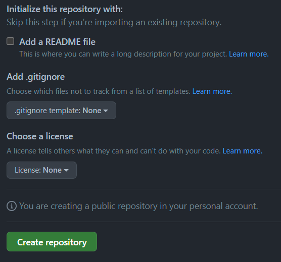

# GitHub Overview

GitHub is an online platform that allows, in part, to host git repository and offers features to facilitate collaboration during software development.<br>
In git terminology, a platform to host git repository is called a `remote`.

This tutorial only covers the basics of GitHub. For a complete overview, we suggest reading the [Official GitHub Quickstart](https://docs.github.com/en/get-started/quickstart/hello-world).

## Creating a repository on GitHub

At the top-right, of the [github website](https://github.com/) you will find a `+` icon.
Click on it, then choose the "New repository" option.


When creating the project, make sure to have no **"Add a README file"**, `.gitignore`, or License options selected. Since we already create a local project, this would result in conflict with the repository history.


### SSH key

Lastly, to give permission for Git to interact with GitHub an SSH key should be added to your account. Go on your **profile (top right)**, then into **Preferences**, and into **SSH Keys** into the menu. You can paste your SSH public key there.

In case you do not have an SSH key, you can generate one on your project VM using
<br/>**Note:** The `<comment>` is optional, but can be helpful in identifying where the SSH key was generated.

```bash
$ ssh-keygen -t ed25519 -C "<comment>"
```

After running this command, you will find your SSH public key at the location `~/.ssh/id_ed25519.pub`.

## Interaction between Git and GitHub

Once the project is create, you can find the remote url for you repository here:<br>
Note: Select the "SSH" url instead of the "HTTPS" one.


To upload code to a remote repository, Git needs to be aware of it by registering the remote as follow

```bash
$ git remote add [remote-name] [url]
```

To push (upload) the version of the Git repository to a remote location, use the command

```bash
$ git push
```

**Note:** the first time a branch is pushed, it is required to specify the remote and the name of the branch for the remote.

```bash
$ git push -u [remote-name] [current-branch]
```

When changes are made on a remote repository, it is possible to pull (download) them locally using

```bash
$ git pull
```
